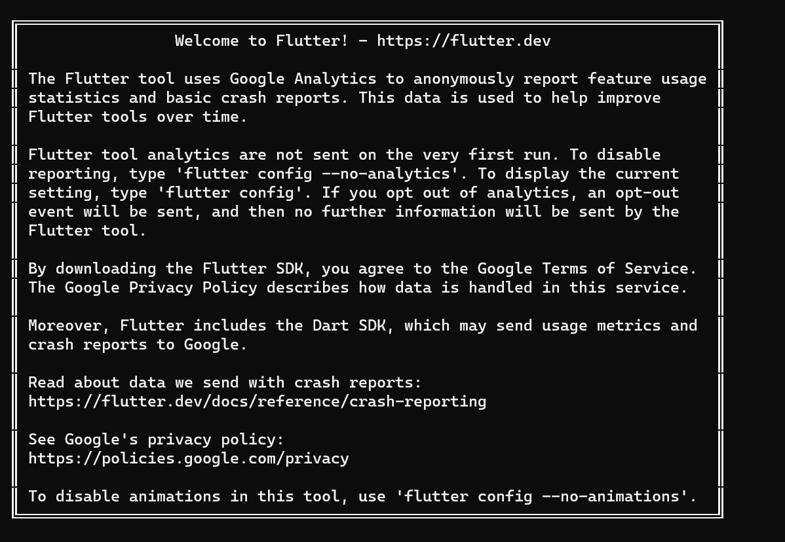
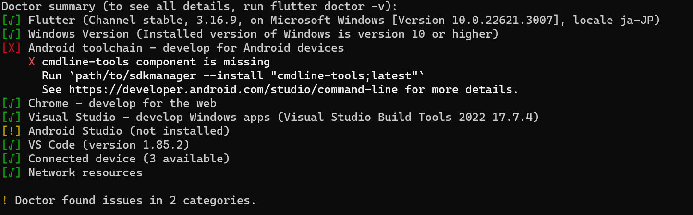
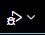

# Flutter 環境構築

## インストール

１．以下から zip ファイルをインストールする。

- https://docs.flutter.dev/get-started/install/windows/web?tab=download

２．任意のディレクトリで解凍する。

３．解凍した flutter ファイルの中にある bin ファイルのパスをコピーする。

## 環境変数にパスを通す

１．設定を開いてシステム＞バージョン管理＞システムの詳細設定を開く。

２．コピーした bin ファイルのパスを追加する。

## 確認

`flutter doctor` をコマンドプロンプトで実行する。

## デモ画面の表示

１．vscode を開く。

２．次のエラーが表示されている場合はコピーした bin ファイルのパスを Locate SDK に設定する。

    Could not find a flutter SDK. Please ensure flutter is installed and in your PATH(you may need restart).

３．実行する。

次の 2 パターンの方法がある。

- デバッグボタン  を押下して実行。

- `flutter run`をターミナルで実行し任意のブラウザを選択する。

  ※ホットリロードが機能しないため変更を加えた後 r キーを押下する必要がある。
